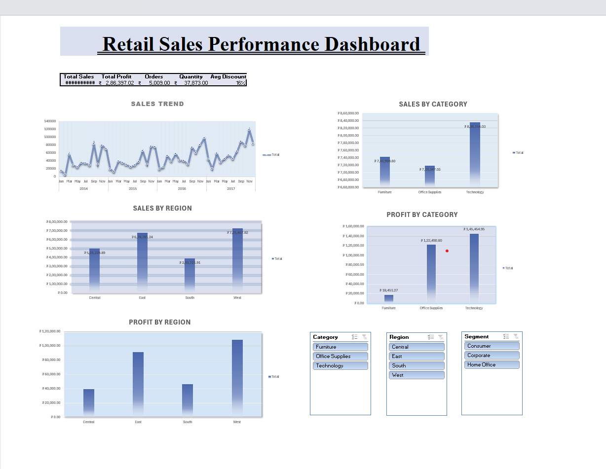
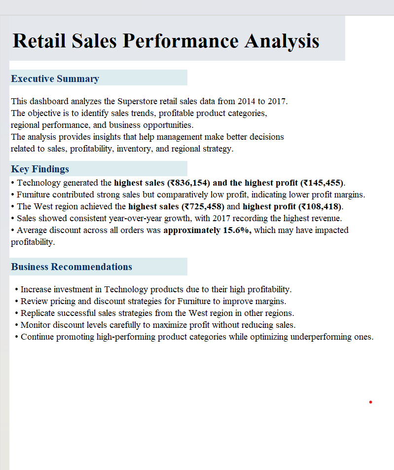

# 📊 Retail Sales Performance Dashboard

## Project Overview
This project analyzes Superstore retail sales data (2014–2017) using Microsoft Excel. The dashboard provides insights into sales trends, profitability, regional performance, and product category performance to support business decision-making.

---

## Objectives
- Analyze sales performance over time
- Identify the most profitable product categories
- Compare regional sales and profit
- Provide business recommendations based on the analysis

---

## Tools Used
- Microsoft Excel
- Pivot Tables
- Pivot Charts
- Slicers
- Dashboard Design
- Data Analysis

---

## Dashboard Preview

### Dashboard

### Business Insights

---

## Key Findings
- Technology generated the highest sales and profit.
- Furniture had high sales but lower profit margins.
- West region recorded the highest overall profit.
- Sales increased consistently from 2014 to 2017.

---

## Business Recommendations
- Increase investment in Technology products.
- Improve Furniture pricing strategy.
- Replicate West region sales strategies in other regions.
- Monitor discounts carefully to protect profitability.

---

## Files Included
- [Retail-Sales-Performance-Dashboard.xlsx](Retail-Sales-Performance-Dashboard.xlsx)
- [Retail-Sales-Performance-Dashboard.png](Retail-Sales-Performance-Dashboard.png)
- [Retail-Sales-Performance-Insights.png](Retail-Sales-Performance-Insights.png)
  

